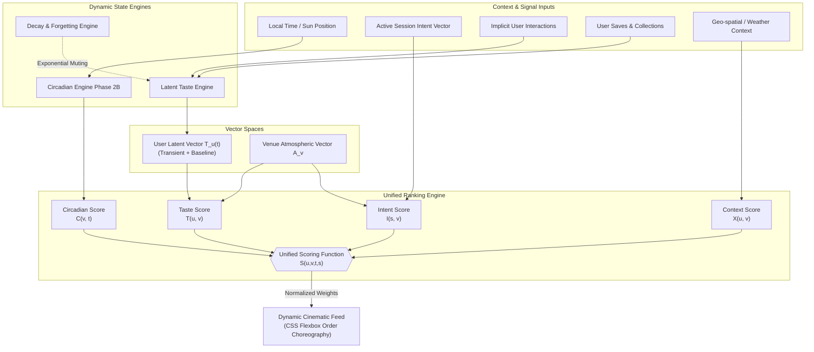

# Korantis Phase 2C — Latent Taste + Ranking Architecture

This document defines the mathematical, data-flow, and conceptual blueprint for evolving Korantis from a **time-reactive UI** into a **time-aware + user-adaptive perceptual ranking system**. It defines the next architectural layer of the recommendation and personalization engine without introducing code or database schemas.

---

## 1. System Overview

Phase 2C introduces a **perceptual ranking and personalization layer** layered directly over the existing Phase 2B Circadian Emotional Engine. It transitions Korantis from a passive, time-shifting venue showcase into an active, multi-dimensional discovery graph. By combining the existing sun-linked circadian atmospheric drift with a persistent user **Latent Taste Vector**, real-time **Session Intent Signals**, and a **decay-aware implicit feedback loop**, this architecture ensures that spatial recommendations feel poetic, deeply personal, and highly situational. It prioritizes serendipitous spatial matches over flat chronological ordering or cold, transactional clicks.



---

## 2. Core Concept: Latent Experience Vector

To model the poetic nuance of human taste without resorting to cold, clinical categories (e.g., *"Italian"*, *"Café"*), Korantis maps both users and physical spaces into a shared, continuous, low-dimensional coordinate space called the **Latent Experience Vector Space**.

### The Vector Space Representation
Let the Latent Experience Space be defined by a $d$-dimensional vector space ($d = 8$), representing continuous emotional, sensory, and behavioral axes rather than business listings:
$$\mathbf{T}_u(t) \in [-1, 1]^d \quad \text{and} \quad \mathbf{A}_v \in [-1, 1]^d$$

The 8 coordinates ($x_1$ through $x_8$) correspond to the following perceptual spectrums:
1. **$x_1$: Solitude vs. Sociality** (e.g., quiet corners for introspection vs. buzzing hubs for group interaction)
2. **$x_2$: Restrained Luxury vs. Raw Authenticity** (e.g., high-end minimal design vs. rustic, unpolished, underground spots)
3. **$x_3$: Cool Intellectualism vs. Warm Sensuality** (e.g., stark brutalist galleries and quiet libraries vs. intimate candlelit bars)
4. **$x_4$: Sunlight / Openness vs. Amber Shadow / Enclosure** (e.g., glass pavilions and botanical courtyards vs. basement jazz clubs)
5. **$x_5$: Fast-Paced Ritual vs. Slow Pause** (e.g., high-throughput espresso bars vs. multi-hour lingering spots)
6. **$x_6$: Urban Edge vs. Nature Infusion** (e.g., concrete rooftops and street-facing windows vs. lush garden sanctuaries)
7. **$x_7$: Minimal Clarity vs. Ornate Layering** (e.g., Nordic/Japanese simplicity vs. maximalist textures and retro clutter)
8. **$x_8$: Nostalgia vs. Avant-Garde** (e.g., historical landmarks and vintage lounges vs. experimental concept studios)

### Taste Evolution & Vector Drift
The User Latent Taste Vector $\mathbf{T}_u(t)$ is a dynamic, living entity. It is not static; it constantly drifts. It is represented as a dual-layer model:

$$\mathbf{T}_u(t) = (1 - \alpha) \cdot \mathbf{T}_u^{\text{baseline}} + \alpha \cdot \mathbf{T}_u^{\text{transient}}(t)$$

- **$\mathbf{T}_u^{\text{baseline}}$ (Long-Term Baseline)**: Reflects the slowly shifting, hard-won tastes of the user, built upon permanent saves, curated collections, and repeated physical check-ins. It updates in micro-steps.
- **$\mathbf{T}_u^{\text{transient}}(t)$ (Short-Term Transient)**: Captures the user's immediate emotional mood, current circadian craving, and immediate context. It drifts rapidly based on real-time micro-interactions.
- **$\alpha$ (Transient Weight)**: A dynamic scalar ($0 \le \alpha \le 1$) representing how much the immediate state dominates. When a user has a highly active session with rapid query typing or interactions, $\alpha$ increases; when in a passive browsing state, $\alpha$ decreases, anchoring the experience to their baseline.

---

## 3. Unified Ranking Function

To present a single editorial stream, Korantis calculates a unified affinity score $S(u, v, t, s)$ for each venue $v$ relative to user $u$ at current time $t$ in active session $s$. Rather than sorting by star-rating or location alone, the system balances four distinct scores.

### Conceptual Scoring Formula
$$S(u, v, t, s) = w_c(s) \cdot C(v, t) + w_t(s) \cdot T(u, v) + w_i(s) \cdot I(s, v) + w_x(s) \cdot X(u, v)$$

Where the scoring factors are defined as:

1. **Circadian Score, $C(v, t) \in [0, 1]$**
   Measures the alignment of the venue's peak natural atmosphere with the current local time $t$. Let $\text{peak}_v$ be the hour (0-24) at which venue $v$ experiences its peak atmosphere (e.g., 18.0 for a sunset rooftop, 09.5 for a morning café). Using circular hours distance:
   $$C(v, t) = 1 - \frac{\min(|t - \text{peak}_v|, 24 - |t - \text{peak}_v|)}{12}$$

2. **Taste Score, $T(u, v) \in [-1, 1]$**
   Measures semantic similarity between the user's current Latent Taste Vector $\mathbf{T}_u(t)$ and the venue's static Atmospheric Vector $\mathbf{A}_v$:
   $$T(u, v) = \cos(\mathbf{T}_u(t), \mathbf{A}_v) = \frac{\mathbf{T}_u(t) \cdot \mathbf{A}_v}{\|\mathbf{T}_u(t)\| \|\mathbf{A}_v\|}$$

3. **Intent Score, $I(s, v) \in [-1, 1]$**
   Measures the proximity of the venue to the user's active session query or semantic filter. If the user enters a query like *"secluded patio for deep talk"*, this is mapped to a transient Intent Vector $\mathbf{I}_s \in [-1, 1]^d$ using a fast embedding translator:
   $$I(s, v) = \cos(\mathbf{I}_s, \mathbf{A}_v)$$

4. **Context Score, $X(u, v) \in [0, 1]$**
   An environment-level modifier. It combines physical distance decay, current weather constraints (e.g., rain multiplies the penalty for high outdoor-exposure venues), and a novelty-boost factor designed to gently push unexplored physical gems to prevent feed stagnation.

### Dynamic Weight Modulation
The weights $w_c, w_t, w_i, w_x$ are constrained such that $\sum w_n = 1$. They automatically morph based on the user's interface state:

| State | $w_c$ (Circadian) | $w_t$ (Taste) | $w_i$ (Intent) | $w_x$ (Context) | Rationale |
| :--- | :--- | :--- | :--- | :--- | :--- |
| **Passive Discovery** | **0.40** | **0.40** | **0.00** | **0.20** | Relies heavily on time of day and historical tastes. |
| **Active Semantic Search** | **0.10** | **0.20** | **0.60** | **0.10** | Boosts active search intent, letting specific user requests override natural circadian states. |
| **Localized / Rain Mode** | **0.20** | **0.20** | **0.10** | **0.50** | Elevates spatial and weather proximity due to high friction in transit. |

---

## 4. Interaction Feedback Loop

To keep the system alive without demanding explicit reviews or ratings, the taste engine operates entirely on **implicit behavioral feedback**. Every action in the cinematic UI acts as a micro-update to the latent taste model.

```
                  ┌─────────────────────────────────┐
                  │      User Interaction on UI     │
                  └────────────────┬────────────────┘
                                   │
                 ┌─────────────────┼─────────────────┐
                 │                 │                 │
                 ▼                 ▼                 ▼
             [ Click ]       [ Dwell Time ]   [ Pass-Through ]
           Card Expanded      Time on Screen     Scrolled Past
                 │                 │                 │
                 ▼                 ▼                 ▼
            Transient +       Log-Linear      Active Penalty
            Drift Step        Scale Reward     to Intent Vector
                 │                 │                 │
                 └─────────────────┼─────────────────┘
                                   │
                                   ▼
                   ┌───────────────────────────────┐
                   │ Update Transient Latent Vector│
                   │    T_u^transient(t_next)      │
                   └───────────────┬───────────────┘
                                   │
                                   ▼
                   ┌───────────────────────────────┐
                   │  Recalculate Feed Ordering    │
                   │      (CSS Flexbox order)      │
                   └───────────────────────────────┘
```

The system translates four distinct behaviors into mathematical adjustments to the user's transient vector $\mathbf{T}_u^{\text{transient}}$:

### 1. Click / Card Expansion ($a_{\text{click}}$)
- **Signal**: Extremely high curiosity.
- **Action**: Direct attraction drift. The transient taste vector shifts immediately toward the selected venue's atmospheric signature:
  $$\mathbf{T}_u^{\text{transient}}(t_{\text{next}}) = \mathbf{T}_u^{\text{transient}}(t) + \eta_{\text{click}} \cdot \left(\mathbf{A}_v - \mathbf{T}_u^{\text{transient}}(t)\right)$$
  *Where $\eta_{\text{click}} = 0.15$ (high learning rate, immediate impact).*

### 2. Dwell Time ($a_{\text{dwell}}$)
- **Signal**: Sustained emotional alignment.
- **Action**: Dwell time $\Delta t$ is evaluated log-linearly rather than linearly to prevent outlier scaling (e.g., leaving the phone unlocked).
  - If $\Delta t < 2\text{s}$: Treated as accidental click; no adjustment.
  - If $\Delta t \ge 2\text{s}$: Reinforces taste coordinates via a graded logarithmic factor:
    $$r(\Delta t) = \ln(1 + \Delta t - 2\text{s})$$
    $$\mathbf{T}_u^{\text{transient}}(t_{\text{next}}) = \mathbf{T}_u^{\text{transient}}(t) + \left(\eta_{\text{dwell}} \cdot r(\Delta t)\right) \cdot \left(\mathbf{A}_v - \mathbf{T}_u^{\text{transient}}(t)\right)$$
    *Where $\eta_{\text{dwell}} = 0.05$.*

### 3. Scroll Pass-Through ($a_{\text{pass}}$)
- **Signal**: Low atmospheric interest or misalignment.
- **Action**: If a venue card enters the viewport for less than $0.8$ seconds while the user is actively scrolling, it is classified as a pass-through. The system applies a subtle repulsive force *away* from this venue's atmosphere, but strictly restricted to the transient intent state to avoid destroying long-term affinity:
  $$\mathbf{T}_u^{\text{transient}}(t_{\text{next}}) = \mathbf{T}_u^{\text{transient}}(t) - \eta_{\text{pass}} \cdot \left(\mathbf{A}_v - \mathbf{T}_u^{\text{transient}}(t)\right)$$
  *Where $\eta_{\text{pass}} = 0.02$.*

### 4. Ignore Behavior ($a_{\text{ignore}}$)
- **Signal**: Selective blindspot or visual fatigue.
- **Action**: If a card is rendered fully in the active viewport for $>3.0$ seconds but receives zero clicks or stops, the venue's specific unique dimension (e.g., heavy natural light) is slightly damped in the short-term vector. This creates a natural "blindspot prevention" mechanism.

---

## 5. Decay + Forgetting Model

Without a rigorous forgetting architecture, recommendation algorithms suffer from rapid overfitting and feedback loop locking. Korantis prevents this by subjecting the latent taste layer to two distinct continuous decay processes.

```
       TRANSIENT TASTE VECTOR                         LONG-TERM BASELINE
      [ T_u^transient(t) ]                       [ T_u^baseline ]
               │                                         │
               │                                         │
               │   Continuous Decay                      │
               ▼  (T_half = 2 Hours)                     │
         [ Decay Engine ] <──────────────────────────────┘
               │
               ▼
   "Transient state is constantly
   drawn back to the baseline tide"
```

### The Dual-Layer Decay System

#### Transient Decay (Intraday Drift)
The short-term transient vector $\mathbf{T}_u^{\text{transient}}(t)$ continuously decays back toward the user's long-term baseline taste vector $\mathbf{T}_u^{\text{baseline}}$. This ensures that a localized, sudden search (e.g., searching for a noisy bar on a Saturday afternoon) does not permanently poison a user's normal quiet café workflow.
$$\mathbf{T}_u^{\text{transient}}(t + \Delta t) = \mathbf{T}_u^{\text{baseline}} + e^{-\lambda_{\text{transient}} \cdot \Delta t} \cdot \left(\mathbf{T}_u^{\text{transient}}(t) - \mathbf{T}_u^{\text{baseline}}\right)$$

- **Time Constant**: Half-life ($T_{1/2}$) of $\mathbf{T}_u^{\text{transient}}$ is set to **2 hours** ($\lambda_{\text{transient}} \approx 0.346\text{ hr}^{-1}$).
- **Result**: The immediate mood resets between natural day parts (morning → afternoon → night).

#### Baseline Decay (Slow Migration)
Even the long-term baseline is subject to high-dimensional drift to reflect genuine lifestyle shifts over years:
$$\mathbf{T}_u^{\text{baseline}}(t + \Delta t) = (1 - \beta) \cdot \mathbf{T}_u^{\text{baseline}}(t) + \beta \cdot \mathbf{E}_{\text{stable}}$$

- **Time Constant**: The long-term profile is updated using a monthly windowing function, with a half-life of **30 days** to prevent fast over-sensitization.
- **Regularization**: The target baseline is regularized toward a global editorial centroid ($\mathbf{E}_{\text{stable}}$) to prevent a user's coordinate mapping from drifting to extreme mathematical boundaries (which causes extreme, unrecoverable filtering).

---

## 6. Integration Rule with Circadian Engine

The Phase 2C personalization layer must exist in absolute harmony with the Phase 2B Circadian Emotional Engine. It does not replace it; instead, it establishes clear spatial and functional boundaries.

### What Circadian Controls (Visuals and Atmospheric Context)
- **UI Mood and Atmospheric Shifts**: The Circadian Engine remains the absolute master of the interface's aesthetic temperature. CSS custom properties for background ambient colors (`--k-ambient-r`, etc.), film grain intensity (`--k-grain-intensity`), text contrast (`--k-text-contrast`), and motion speed scales (`--k-motion-scale`) are driven exclusively by the sun's circular clock cycle.
- **Atmospheric Pacing**: The interface continues to "breathe" independent of user behavior. A user with highly energetic social taste will still experience a quiet, deeply intimate visual atmosphere if they open the application at 2:00 AM.
- **The Cold-Start Vector**: When a user is anonymous, has zero interaction history, or has empty search parameters, the feed relies 100% on the Circadian Score $C(v, t)$ for ordering.

### What personalizes (Content Ordering)
- **Choreography Control**: The dynamic recalculation of CSS `order` in the feed transitions from a single-factor circadian circular distance calculation to the Unified Ranking Function $S(u, v, t, s)$.
- **Coexistence without Jumps**: Just like the circadian engine, the taste updates *never* trigger active feed jumps while the user is actively viewing a list. Updates to `order` are calculated in the background and applied smoothly on subsequent page transitions, search executions, or viewport refreshes, protecting the poetic, slow flow of the UI.

---

## 7. System Failure Modes

Designing a highly dynamic emotional search system creates distinct behavioral and mathematical risks. Korantis explicitly architected solutions to mitigate three primary failure modes:

### 1. Over-Personalization Collapse ("The Solitude Trap")
- **The Failure**: A user clicks on a couple of hyper-isolated, silent venues in the morning. Their transient vector shifts heavily to $x_1 = -1$ (extreme solitude). The ranking system immediately penalizes all social, buzzing spaces. Because the user is only shown silent libraries, they click only on silent libraries, locking them forever into a sterile, quiet echo chamber.
- **The Architecture Solution**: Introduce a **Serendipity Epsilon Factor ($\epsilon = 0.15$)**. In every feed generation, 15% of the slots are reserved for atmospheric vectors that lie *orthogonal* to the user's current latent vector. Additionally, the exponential decay back to baseline ensures that the user's taste naturally relaxes and opens back up within 2 hours of inactivity.

### 2. Temporal Bias Overpowering Taste ("The Nighttime Blindspot")
- **The Failure**: At 2:00 AM, the circadian bias strength peaks. Because the circadian score $C(v, t)$ is so heavily weighted, it completely drowns out a user's latent taste for quiet late-night study spaces. The feed is taken over entirely by dark wine bars and intimate music lounges, hiding functional spaces that remain open late but have "daytime" atmospheric peaks.
- **The Architecture Solution**: Introduce **Adaptive Circadian Damping**. The circadian weight $w_c$ is inversely scaled by the magnitude of the user's active intent vector $\mathbf{I}_s$. If a user enters a highly specific search query at 2:00 AM, the circadian influence drops to a negligible background weight ($w_c \to 0.05$), ensuring precise query fulfillment over ambient matching.

### 3. Feedback Loop Reinforcement Loops ("The Viewport Trap")
- **The Failure**: A venue happens to be ranked #1 by circadian alignment initially. Because it is on top, it receives the highest visibility, accumulating the most dwell time and clicks. The feedback loop registers this as an intense taste match, further inflating its score, locking it at #1 permanently regardless of real user affinity.
- **The Architecture Solution**: **Impression Decay & Viewport Weighting**. The feed ranking engine applies a positional discount factor to interactions (e.g., a click on slot #1 yields a much lower transient drift reward than a click on slot #8). Additionally, if a venue remains in the top 3 slots for three consecutive sessions but receives zero engagement, its Context Score $X(u, v)$ is temporary suppressed (decayed) to allow fresh candidates to bubble to the top.
