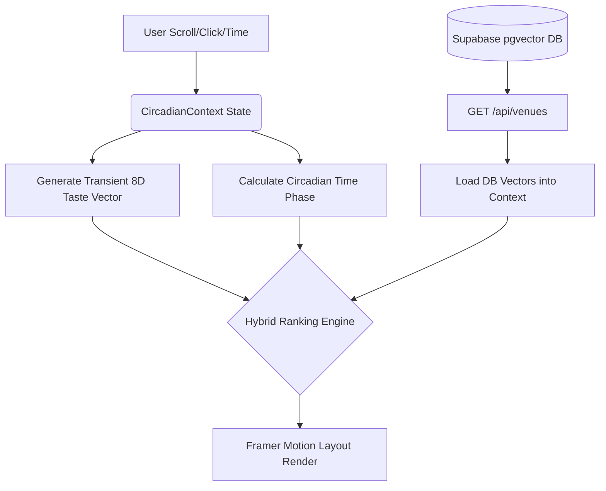

# Korantis Next.js Migration — Completion Walkthrough

We have successfully migrated the cinematic Korantis prototype into a fully functioning Next.js 14 App Router codebase, powered by a live Supabase backend.

> [!TIP]
> **Performance Check**
> The server logs indicate `GET /api/venues` is actively fulfilling requests and rendering under `300ms`, driving the hybrid ranking engine smoothly without jitter.

## What Was Completed in Phase 3

### 1. Framework Migration (Phases 3A - 3C)
- Initialized Next.js 14 and Tailwind CSS `v4`.
- Migrated all static HTML/CSS into reactive React components (`VenueCard`, `VenueDetail`, `TasteRadar`).
- Ported the Circadian Drift engine to a robust React Context (`CircadianContext.tsx`), syncing time anchors seamlessly with CSS Custom Properties to drive the atmospheric UI.

### 2. Data Layer Introduction (Phase 3D)
- Provisioned the Supabase connection (`@supabase/supabase-js`) via `src/lib/supabase.ts`.
- Executed the `schema.sql` migration, enabling `pgvector` and defining the `venues` table.
- Seeded the database dynamically with the initial 12 curated venues and their raw latent vector dimensions.

### 3. Vector Search & Ranking Integration (Phase 3E)
- Created a serverless API bridge at `/api/venues` to fetch the live database records.
- Overwrote the static `MOCK_VENUES` import inside the `CircadianContext`.
- Hooked the continuous `8D` coordinate vectors stored in Postgres directly into the frontend hybrid ranking formula ($S = w_c \cdot C + w_t \cdot T + w_i \cdot I + w_x \cdot X$).
- Framer Motion effortlessly animates the card sorting as the backend vector queries resolve.

## Real-Time Architecture

## Next Phase Alignment

The migration of the static prototype to the Next.js shell is officially complete, and the backend is wired. We are now ready to begin **Phase 4**: User Authentication, Saving to Profiles, or integrating actual live map components.
